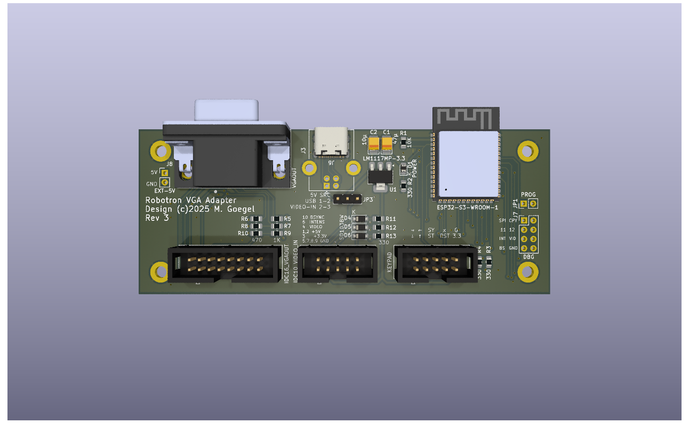
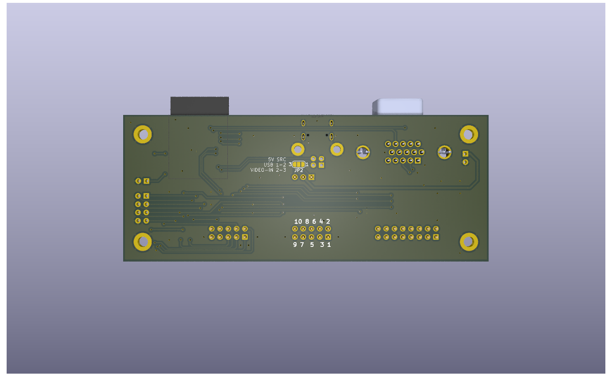
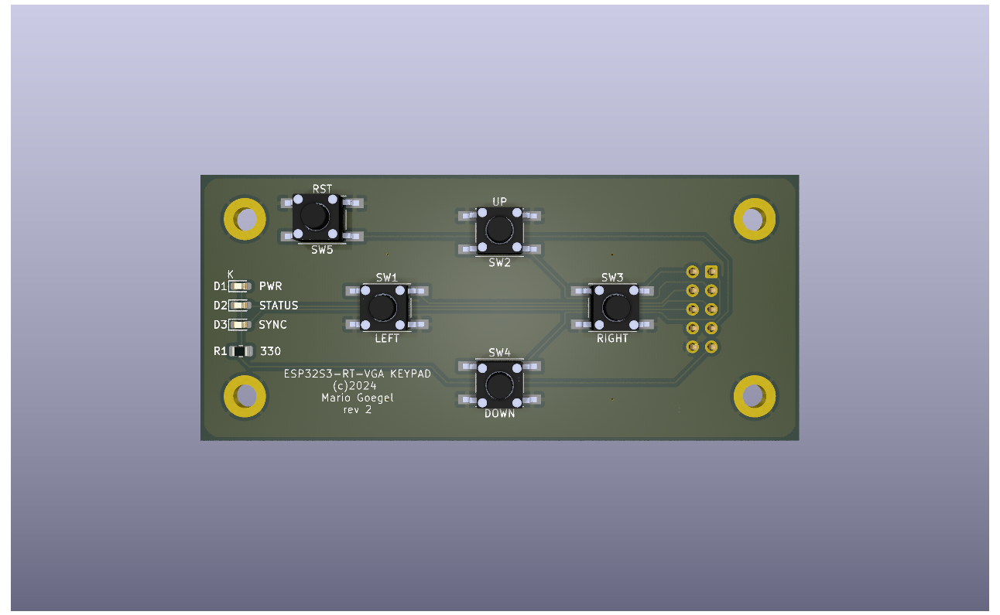
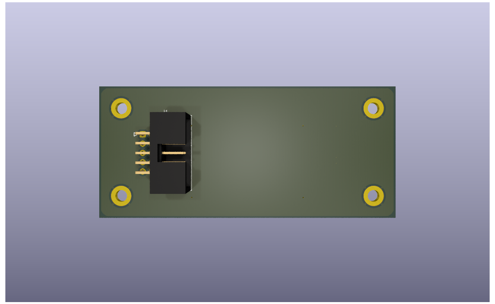

# Robotron VGA Adapter PCB

This project is based on the work of Stefan "Ordoban" Berndt.

ESP32S3 based MDA to VGA adapter

{width=300px} {width=300px}

{width=300px} {width=300px}

[Schematics](pc1715-esp32vga/schematics/pc1715-esp32vga.pdf)

Supported systems:  
[Connection A7100](Connections.md)
* A7100 
* A7150/CM1910 Text-only
* EC1834 MON Adapter (K7228.1, K7229.21-.24, Alpha 1 Monitor replacement)

[Connection PC1715](Connections.md)
* PC1715 
* A5120/K8924
* MC 80.30

[Connection VIDEO3/NANOS](Connections.md)
* NANOS

Published at: https://www.robotrontechnik.de/html/forum/thwb/showtopic.php?threadid=21380

The software is here: https://github.com/mgoegel/robotron-esp-vga

An (little bit outdated) order list is available at reichelt: https://www.reichelt.de/my/2181752 
I'll add mouser, as soon as I found out, how to publish the list... ;-)

Also you can find the BOM for both PCBs
* [Main board](pc1715-esp32vga/bom/ibom.html)
* [Keypad](esp32vga-keypad/bom/ibom.html)

### Main Board PIN Connector PINOUT

#### VGA J2 (D-SUB 15HD) / J5 (IDC16_VGA)

| D_SUB 15 HD | Signal | Pin | Pin | Signal | D_SUB 15 HD |
| ----------- | ------ | --- | --- | ------ | ----------- |
| 1           | RED    | 1   | 2   | GREEN  | 2           |
| 3           | BLUE   | 3   | 4   | NC     |             |
| 6           | GND    | 5   | 6   | GND    | 5           |
| 7           | GND    | 7   | 8   | GND    | 10          |
| 8           | GND    | 9   | 10  | GND    | NC          |
|             | NC     | 11  | 12  | NC     |             |
| 13          | HSYNC  | 13  | 14  | VSYNC  | 14          |
|             | NC     | 15  | 16  | NC     |             |

#### VIDEO IN J1

| Signal      | Pin | Pin | Signal |
| ----------- | --- | --- | ------ |
| 5V IN       | 1   | 2   | 5V IN  |
| 3.3V IN/OUT | 3   | 4   | VIDEO  |
| GND         | 5   | 6   | INTENS |
| GND         | 7   | 8   | GND    |
| GND         | 9   | 10  | BSYNC  |

#### KEYPAD J4

| Signal  | Pin | Pin | Signal  |
| ------- | --- | --- | ------- |
| K_DOWN  | 1   | 2   | K_RIGHT |
| K_UP    | 3   | 4   | K_LEFT  |
| L_STAT  | 5   | 6   | L_SYNC  |
| RST     | 7   | 8   | NC      |
| 3.3V    | 9   | 10  | GND     |

#### DEBUG J7 2x04

| Signal | Pin | Pin | Signal |
| ------ | --- | --- | ------ |
| TP-SPI | 1   | 2   | TP-CPY |
| TP-11  | 3   | 4   | TP-12  |
| INTENS | 5   | 6   | VIDEO  |
| BSYNC  | 7   | 8   | GND    |
